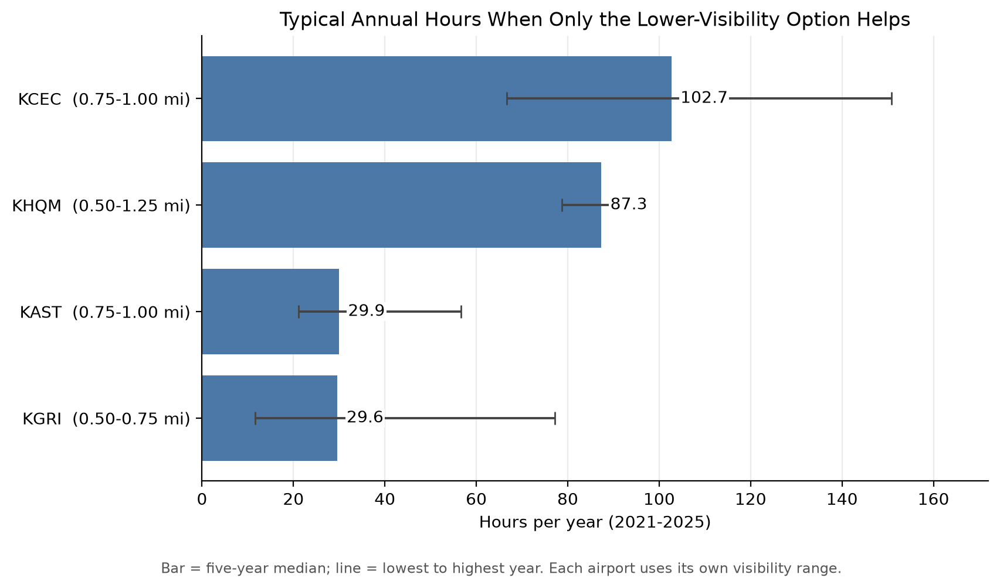
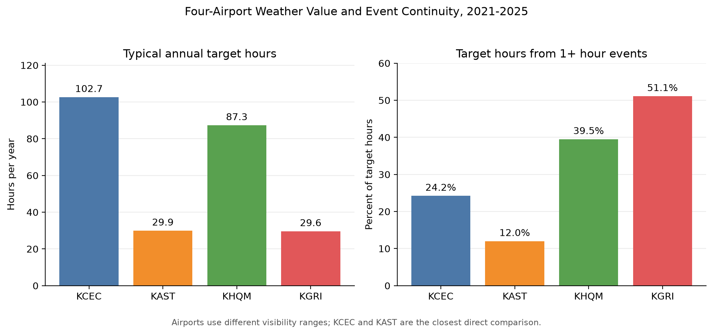

# Which Airports Deserve Further Study of Lower-Visibility Approach Options?

This project uses five years of airport weather observations to identify where a lower-visibility approach option has enough historical weather opportunity to justify further cost, maintenance, and operational research.

Four U.S. airports are evaluated independently using their own visibility requirements published by the U.S. Federal Aviation Administration (FAA):

- KAST — Astoria Regional Airport, Oregon
- KCEC — Jack Mc Namara Field, California
- KHQM — Bowerman Field, Washington
- KGRI — Central Nebraska Regional Airport, Nebraska

The project is a weather-based screening study. It does not make a final equipment or investment decision, and meeting a visibility requirement does not guarantee that an aircraft can land.

## Research Question

For each airport, the analysis measures the time when the higher-visibility option no longer met its visibility condition but the lower-visibility option still did.

For example, if one option requires at least 1 mile of visibility and another requires at least 0.75 mile, the target range is:

```text
0.75 mile <= visibility < 1.00 mile
```

Each airport uses its own FAA-published values:

| Airport | Lower requirement | Other requirement | Target range |
|---|---:|---:|---:|
| KAST | 0.75 mi | 1.00 mi | 0.75 to <1.00 mi |
| KCEC | 0.75 mi | 1.00 mi | 0.75 to <1.00 mi |
| KHQM | 0.50 mi | 1.25 mi | 0.50 to <1.25 mi |
| KGRI | 0.50 mi | 0.75 mi | 0.50 to <0.75 mi |

The airports are first analyzed independently. Their results are then compared to assign a relative priority for further research. Because the target ranges are not identical, the comparison is not a universal investment ranking.

## Main Results

| Airport | Typical annual hours | Lowest–highest year | Median event | Hours from 1+ hr events | Research priority |
|---|---:|---:|---:|---:|---|
| KHQM | 87.32 | 78.70–91.97 | 18 min | 39.51% | Highest |
| KCEC | 102.65 | 66.62–150.87 | 15 min | 24.22% | High |
| KGRI | 29.63 | 11.58–77.12 | 21 min | 51.11% | Conditional |
| KAST | 29.95 | 21.05–56.70 | 12 min | 12.00% | Lowest |

KHQM and KCEC show the strongest weather-based reasons for further research. KGRI is a conditional case because its target weather is less frequent but sometimes sustained. KAST shows the weakest weather case in this four-airport sample.

The two main comparison figures are:





## Data

Weather observations cover January 1, 2021 through December 31, 2025 and come from the Iowa Environmental Mesonet ASOS/METAR archive. METAR is a standard format for routine airport weather observations. The original downloaded CSV files are included unchanged in `raw/`.

FAA approach charts supplied the two visibility requirements used for each airport. The chart values were checked on July 25, 2026 using chart cycle 2607.

Only report time and visibility are required for the main calculations.

## Data Cleaning and Analysis

The analysis performs the following steps:

1. Read each raw CSV file and convert report times and visibility values.
2. Remove invalid times and duplicate station-time reports.
3. Sort the remaining reports chronologically.
4. Let each valid report represent the interval until the next report, capped at one hour.
5. Treat time beyond the one-hour cap as unknown instead of extending an old observation indefinitely.
6. Classify each interval using that airport's target visibility range.
7. Calculate annual target hours and use the median of the five annual totals as the typical annual value.
8. Join consecutive target intervals into events until the weather leaves the target range or an uncovered gap appears.
9. Calculate event counts, median duration, maximum duration, and the share of target hours from events lasting at least one hour.

The interval method is necessary because METAR reports are not equally spaced. Simply counting rows would overrepresent periods when changing weather produced additional reports.

## Project Structure

```text
codes/     Python analysis and visualization scripts
raw/       Original weather-data downloads
results/   Cleaned intervals, event data, and summary CSV files
pics/      Generated charts
README.md  Project documentation and reproduction instructions
CMPT353_Final_Project_Report.pages  Final written report
```

## Requirements

- Python 3
- pandas
- matplotlib

Install the required libraries with:

```bash
python3 -m pip install pandas matplotlib
```

Run all commands from the `final_project` directory. The scripts do not require command-line arguments because their input and output paths are defined inside the files.

## Reproducing the Final Analysis

Generate the five-year results for each airport:

```bash
python3 codes/kast_2021_2025_analysis.py
python3 codes/kcec_2021_2025_analysis.py
python3 codes/khqm_2021_2025_analysis.py
python3 codes/kgri_2021_2025_analysis.py
```

Generate the four-airport annual comparison and chart:

```bash
python3 codes/compare_2021_2025_airports.py
```

Generate the event-duration results:

```bash
python3 codes/kast_event_analysis.py
python3 codes/kcec_event_analysis.py
python3 codes/khqm_event_analysis.py
python3 codes/kgri_event_analysis.py
```

Generate the final event comparison and chart:

```bash
python3 codes/compare_event_durations.py
```

The main combined outputs are:

```text
results/airport_2021_2025_comparison.csv
results/airport_2021_2025_event_comparison.csv
pics/airport_2021_2025_typical_hours.png
pics/airport_2021_2025_event_comparison.png
```

The expected final summary values are:

```text
KHQM:  87.32 typical annual hours; 39.51% from 1+ hour events
KCEC: 102.65 typical annual hours; 24.22% from 1+ hour events
KGRI:  29.63 typical annual hours; 51.11% from 1+ hour events
KAST:  29.95 typical annual hours; 12.00% from 1+ hour events
```

## Additional Analyses

The repository also contains 2025-only and monthly analyses:

```bash
python3 codes/kast_2025_analysis.py
python3 codes/kcec_2025_analysis.py
python3 codes/khqm_2025_analysis.py
python3 codes/kgri_2025_analysis.py
python3 codes/compare_2025_airports.py
python3 codes/monthly_2025_analysis.py
```

These scripts create additional tables and charts in `results/` and `pics/`. They are supporting analyses and are not required to reproduce the main five-year conclusions.

## Limitations

The analysis considers visibility only. Actual approach availability may also depend on cloud height, wind, runway condition, equipment status, aircraft configuration, and personnel qualifications.

The four target ranges are not identical. KCEC and KAST provide the strongest like-for-like comparison, while KHQM and KGRI require interpretation alongside range width and event continuity.

The one-hour interval cap limits over-assumption but cannot reconstruct weather perfectly between reports. Current FAA chart values were applied to 2021–2025 weather even though procedures may have changed during that period. Construction, maintenance, and operating costs are outside the scope of this project.

## Sources

### FAA approach charts

- [FAA Digital Terminal Procedures Publication](https://www.faa.gov/air_traffic/flight_info/aeronav/digital_products/dtpp/)
- [KAST chart search, cycle 2607](https://www.faa.gov/air_traffic/flight_info/aeronav/digital_products/dtpp/search/results/?cycle=2607&ident=AST)
- [KCEC chart search, cycle 2607](https://www.faa.gov/air_traffic/flight_info/aeronav/digital_products/dtpp/search/results/?cycle=2607&ident=CEC)
- [KCEC chart with the 0.75-mile value](https://aeronav.faa.gov/d-tpp/2607/00034il12.pdf)
- [KCEC chart with the 1-mile value](https://aeronav.faa.gov/d-tpp/2607/00034v12.pdf)
- [KHQM chart search, cycle 2607](https://www.faa.gov/air_traffic/flight_info/aeronav/digital_products/dtpp/search/results/?cycle=2607&ident=HQM)
- [KHQM chart with the 1.25-mile value](https://aeronav.faa.gov/d-tpp/2607/00889il24.pdf)
- [KHQM chart with the 0.5-mile value](https://aeronav.faa.gov/d-tpp/2607/00889r24.pdf)
- [KGRI chart search, cycle 2607](https://www.faa.gov/air_traffic/flight_info/aeronav/digital_products/dtpp/search/results/?cycle=2607&ident=GRI)
- [KGRI chart with the 0.5-mile value](https://aeronav.faa.gov/d-tpp/2607/00173il35.pdf)
- [KGRI chart with the 0.75-mile value](https://aeronav.faa.gov/d-tpp/2607/00173vd35.pdf)

### Weather data

- [Iowa Environmental Mesonet ASOS/METAR download page](https://mesonet.agron.iastate.edu/request/download.phtml)
- [KAST 2021–2025 weather download](https://mesonet.agron.iastate.edu/cgi-bin/request/asos.py?station=AST&data=all&sts=2021-01-01T00%3A00%3A00Z&ets=2026-01-01T00%3A00%3A00Z&tz=Etc%2FUTC&format=onlycomma&latlon=yes&elev=yes&missing=empty&trace=empty&direct=yes&report_type=3&report_type=4)
- [KCEC 2021–2025 weather download](https://mesonet.agron.iastate.edu/cgi-bin/request/asos.py?station=CEC&data=all&sts=2021-01-01T00%3A00%3A00Z&ets=2026-01-01T00%3A00%3A00Z&tz=Etc%2FUTC&format=onlycomma&latlon=yes&elev=yes&missing=empty&trace=empty&direct=yes&report_type=3&report_type=4)
- [KHQM 2021–2025 weather download](https://mesonet.agron.iastate.edu/cgi-bin/request/asos.py?station=HQM&data=all&sts=2021-01-01T00%3A00%3A00Z&ets=2026-01-01T00%3A00%3A00Z&tz=Etc%2FUTC&format=onlycomma&latlon=yes&elev=yes&missing=empty&trace=empty&direct=yes&report_type=3&report_type=4)
- [KGRI 2021–2025 weather download](https://mesonet.agron.iastate.edu/cgi-bin/request/asos.py?station=GRI&data=all&sts=2021-01-01T00%3A00%3A00Z&ets=2026-01-01T00%3A00%3A00Z&tz=Etc%2FUTC&format=onlycomma&latlon=yes&elev=yes&missing=empty&trace=empty&direct=yes&report_type=3&report_type=4)
